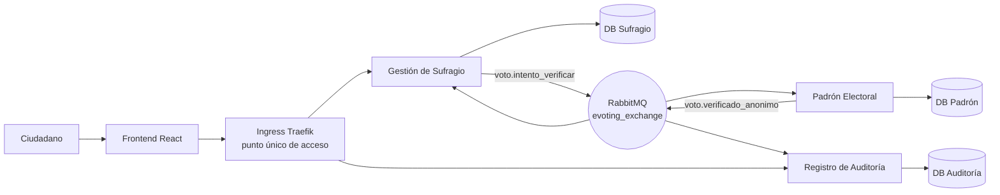

# Proyecto Final - E-Voting (Grupo 6)

## 1. Descripción del Problema

El sistema E-Voting permite validar de forma segura la participación de ciudadanos en un proceso electoral electrónico.

El proceso inicia cuando un ciudadano ingresa su identificador (`ciudadanoId`) y su candidato elegido. Posteriormente se verifica su elegibilidad en el padrón electoral (existe, está habilitado, no ha votado antes) y finalmente se registra la participación de manera **anónima** en un log de auditoría, que permite calcular el resultado real de la elección sin que ninguna fila, en ninguna base de datos, pueda asociar a un ciudadano con el candidato que eligió.

La solución utiliza una arquitectura de microservicios con comunicación asíncrona basada en eventos (RabbitMQ), cada uno con su propia base de datos PostgreSQL aislada.

> **Nota de estado:** este documento describe la arquitectura tal como está implementada en la rama `develop` a la fecha. Hay un punto pendiente marcado explícitamente en la sección 3 (cierre del ciclo con el evento `voto.completado`) que aún no está implementado.

## 2. Arquitectura del Sistema



### 2.1 Componentes

- **Frontend (React + Vite):** interfaz para el ciudadano, sirve un SPA estático detrás de Nginx.
- **Ingress (Traefik, incluido en K3s):** punto único de acceso por nombre de dominio, enruta por path hacia cada microservicio. No existe un microservicio "API Gateway" separado — ver sección 2.4 para la justificación.
- **Gestión de Sufragio (`servicio-sufragio`):** expone la API REST que usa el frontend, inicia la sesión de voto y publica el evento de verificación.
- **Padrón Electoral (`servicio-padron`):** valida elegibilidad del ciudadano y previene doble voto.
- **Registro de Auditoría (`servicio-auditoria`):** registra la participación de forma anónima y expone el conteo/resultado de la elección.
- **RabbitMQ:** exchange `evoting_exchange` (tipo `topic`), comunicación asíncrona entre los tres microservicios.
- **PostgreSQL x3:** una base aislada por microservicio (`db_sufragio`, `db_padron`, `db_auditoria`).

### 2.2 Responsabilidades de los Microservicios

#### 2.2.1 Gestión de Sufragio (`servicio-sufragio`, puerto 3001)

- Expone `GET /api/sufragio/eleccion-activa`, `POST /api/sufragio/votar`, `GET /api/sufragio/estado/:sesionId`.
- Valida y crea la sesión de voto en estado `INICIADO`.
- Publica el evento `voto.intento_verificar` (incluye `candidatoId` de paso, sin persistirlo).
- Consume `voto.verificado_anonimo` para resolver la sesión a `APROBADO` o `RECHAZADO`.
- **Nunca persiste `candidatoId`** en su propia base — solo lo retransmite en el evento.

#### 2.2.2 Padrón Electoral (`servicio-padron`, puerto 3002)

- Escucha el evento `voto.intento_verificar`.
- Verifica si el ciudadano existe, está habilitado y no ha votado antes en esa elección.
- Publica el evento `voto.verificado_anonimo` con el resultado (`APROBADO`/`RECHAZADO`).
- Reenvía `candidatoId` tal cual lo recibió (pass-through) para que auditoría pueda contarlo — **tampoco lo persiste**, ni incluye `ciudadanoId` en lo que publica.

#### 2.2.3 Registro de Auditoría (`servicio-auditoria`, puerto 3003)

- Escucha el mismo evento `voto.verificado_anonimo`.
- Registra la verificación de forma idempotente (única fila por `sesionId`).
- Expone el conteo agregado y el conteo por candidato para tallar la elección.
- Esta base **nunca contiene `ciudadanoId`**, por lo que ninguna fila permite reconstruir quién votó por quién.

> ⚠️ **Pendiente (ver punto 1 del plan de correcciones):** actualmente `servicio-sufragio` y `servicio-auditoria` consumen **el mismo evento `voto.verificado_anonimo` en paralelo**, cada uno desde su propia cola vinculada a esa routing key. No existe todavía un evento `voto.completado` publicado por auditoría al terminar de registrar, así que el ciclo real es S1→S2→(S1 *y* S3 en paralelo), no una cadena secuencial S1→S2→S3→S1 con certificado digital. Esta sección se actualizará cuando se implemente el evento de cierre.

### 2.3 Colas y Bindings de Mensajería

Exchange: `evoting_exchange` (topic, durable). Cada microservicio tiene su propia cola durable con dead-lettering (`evoting_exchange.dlx`) para mensajes no procesables.

| Cola | Binding (routing key) | Productor | Consumidor |
|------|------------------------|-----------|------------|
| `padron.verificar` | `voto.intento_verificar` | Gestión de Sufragio | Padrón Electoral |
| `sufragio.resultado` | `voto.verificado_anonimo` | Padrón Electoral | Gestión de Sufragio |
| `auditoria.registrar` | `voto.verificado_anonimo` | Padrón Electoral | Registro de Auditoría |

### 2.4 Sobre el "API Gateway"

El enunciado pide un punto único de acceso. En este proyecto ese rol lo cumple el **Ingress de Traefik** (incluido por defecto en K3s), que expone un solo dominio por ambiente (`qa.grupo6.uta.cl` / `prod.grupo6.uta.cl`) y enruta por path hacia el frontend y los backends, sin exponer puertos individuales. No se construyó un microservicio "API Gateway" independiente porque el Ingress ya resuelve el requisito de acceso único sin agregar un salto de red adicional que no aporta lógica de negocio. Si se quisiera un Gateway propio (autenticación centralizada, rate limiting, agregación de respuestas), el Ingress simplemente apuntaría a ese nuevo servicio en vez de a los backends directamente.

## 3. Flujo de Negocio (estado actual)

1. El ciudadano abre el frontend, que consulta la elección activa y sus candidatos.
2. El ciudadano envía `ciudadanoId` y `candidatoId` a `POST /api/sufragio/votar`.
3. Gestión de Sufragio crea la sesión en estado `INICIADO` y responde `202 Accepted`.
4. Se publica el evento `voto.intento_verificar`.
5. Padrón Electoral verifica elegibilidad (existe / habilitado / no ha votado) y registra la participación en `votos_efectuados`.
6. Se publica el evento `voto.verificado_anonimo` con el resultado.
7. **En paralelo:** Gestión de Sufragio resuelve la sesión (`APROBADO`/`RECHAZADO`) y Registro de Auditoría guarda el registro anónimo.
8. El frontend hace polling de `GET /api/sufragio/estado/:sesionId` hasta obtener el resultado final.

> ⚠️ Pendiente: un paso 9 donde Auditoría, tras registrar, publique `voto.completado` con un certificado digital y Sufragio lo consuma para cerrar el ciclo de forma secuencial (en vez de que ambos reaccionen en paralelo al mismo evento de Padrón).

## 4. Contratos de Datos

### 4.1 Evento `voto.intento_verificar`

Publicado por Gestión de Sufragio, consumido por Padrón Electoral.

```json
{
  "eventId": "evt-1752345600000",
  "tipo": "voto.intento_verificar",
  "timestamp": "2026-07-13T20:00:00.000Z",
  "origen": "servicio-sufragio",
  "payload": {
    "sesionId": "uuid",
    "ciudadanoId": "12345678-9",
    "eleccionId": "eleccion-2026-presidencial",
    "candidatoId": "cand-001"
  }
}
```

### 4.2 Evento `voto.verificado_anonimo`

Publicado por Padrón Electoral, consumido en paralelo por Gestión de Sufragio y Registro de Auditoría. **Nunca incluye `ciudadanoId`.**

```json
{
  "eventId": "evt-1752345601000",
  "tipo": "voto.verificado_anonimo",
  "timestamp": "2026-07-13T20:00:01.000Z",
  "origen": "servicio-padron",
  "payload": {
    "sesionId": "uuid",
    "eleccionId": "eleccion-2026-presidencial",
    "candidatoId": "cand-001",
    "resultado": "APROBADO",
    "motivo": null,
    "eventoEntradaId": "evt-1752345600000"
  }
}
```

### 4.3 Evento `voto.completado` — pendiente de implementar

Aún no existe en el código. Se documentará aquí junto con el punto 1 del plan de correcciones, una vez que Auditoría lo publique con el certificado digital generado.

## 5. Bases de Datos

Cada microservicio tiene su propia base PostgreSQL aislada, inicializada vía scripts SQL versionados (`db-init/`) y montados también como `ConfigMap` en Kubernetes (`k8s/base/db-init/`).

### 5.1 `db_sufragio` (servicio-sufragio)

**`sesiones_sufragio`**

| Campo | Tipo |
|---|---|
| id | UUID (PK) |
| ciudadano_id | VARCHAR(20) |
| eleccion_id | VARCHAR(50) |
| estado | ENUM `INICIADO` / `APROBADO` / `RECHAZADO` |
| motivo_resultado | VARCHAR(255) |
| fecha_resolucion | TIMESTAMPTZ |

**`elecciones`** — `id`, `nombre`, `activa` (único índice parcial para que solo haya una elección activa), `fecha_inicio`, `fecha_fin`.

**`candidatos`** — `id`, `candidato_id`, `eleccion_id` (FK a `elecciones`), `nombre`, `partido`.

> Esta base nunca guarda `candidatoId` junto a una sesión resuelta — el candidato elegido solo viaja de paso por los eventos.

### 5.2 `db_padron` (servicio-padron)

**`ciudadanos`** — `id`, `ciudadano_id` (único), `nombre`, `apellido`, `habilitado`, `motivo_inhabilitacion`, `elecciones_habilitadas` (array, vacío = habilitado para todas).

**`historial_habilitacion`** — `id`, `ciudadano_id`, `accion` (ENUM `HABILITADO`/`INHABILITADO`), `motivo`, `operador`.

**`votos_efectuados`** — `id`, `ciudadano_id`, `eleccion_id`, `sesion_id`, `fecha_participacion`, con `UNIQUE(ciudadano_id, eleccion_id)` para impedir doble voto. No guarda `candidatoId`.

### 5.3 `db_auditoria` (servicio-auditoria)

**`registros_auditoria`** — `id`, `sesion_id` (único), `eleccion_id`, `candidato_id` (solo si `resultado = APROBADO`), `resultado` (ENUM `APROBADO`/`RECHAZADO`), `motivo`, `evento_origen_id`, `fecha_registro`.

> Esta tabla **nunca contiene `ciudadano_id`**: es la pieza central del diseño de anonimato, junto con el hecho de que `db_sufragio` nunca persiste `candidato_id`.

## 6. Estructura del Proyecto

```
proyecto-aplicaciones-distribuidas/
├── backend/
│   ├── servicio-sufragio/       # S1 — API REST + productor voto.intento_verificar
│   │   └── src/
│   │       ├── config/          # database.js, rabbitmq.js
│   │       ├── consumers/       # resultadoConsumer.js
│   │       ├── controllers/     # sufragioController.js
│   │       ├── models/          # SesionSufragio, Eleccion, Candidato
│   │       ├── producers/       # votoProducer.js
│   │       ├── repositories/
│   │       ├── routes/
│   │       └── services/
│   ├── servicio-padron/         # S2 — valida elegibilidad
│   │   └── src/ (misma estructura: consumers/, producers/, models/ Ciudadano, HistorialHabilitacion, VotoEfectuado ...)
│   └── servicio-auditoria/      # S3 — registro anónimo + resultados
│       └── src/ (consumers/, controllers/, models/ RegistroAuditoria ...)
├── frontend/                    # React + Vite, servido por Nginx en producción
│   └── src/
│       ├── api.js               # cliente REST hacia /api/sufragio
│       └── App.jsx
├── db-init/                     # Scripts SQL fuente (init-sufragio.sql, init-padron.sql, init-auditoria.sql)
├── k8s/
│   ├── base/                    # Recursos comunes (Deployments, Services, PVCs, Secrets, ConfigMaps de init.sql)
│   └── environments/
│       ├── local/                # Overlay para Docker Desktop / K3d local (sin Ingress, vía port-forward)
│       ├── qa/                    # Overlay QA — namespace grupo6-qa, 1 réplica, host qa.grupo6.uta.cl
│       └── prod/                  # Overlay PROD — namespace grupo6-prod, 2 réplicas, host prod.grupo6.uta.cl
├── docker-compose.yml           # Levantamiento local sin Kubernetes
└── README.md
```

## 7. Configuración Local

Hay dos formas de levantar el proyecto localmente: **Docker Compose** (más simple, recomendado para desarrollo del día a día) o **Kubernetes local** (K3d/Docker Desktop, para probar el mismo despliegue que QA/PROD).

### 7.1 Con Docker Compose

Requisitos: Docker y Docker Compose.

```bash
git clone <url-del-repo>
cd proyecto-aplicaciones-distribuidas
docker compose up --build
```

Esto levanta: RabbitMQ (con panel de administración), las 3 bases PostgreSQL (cada una inicializada con su script de `db-init/`) y los 4 servicios de la aplicación.

Puertos expuestos en local:

| Servicio | Puerto |
|---|---|
| Frontend | http://localhost:8080 |
| Gestión de Sufragio (API) | http://localhost:3001 |
| Padrón Electoral (API) | http://localhost:3002 |
| Registro de Auditoría (API) | http://localhost:3003 |
| RabbitMQ (AMQP) | localhost:5672 |
| RabbitMQ (panel admin) | http://localhost:15672 (usuario `admin` / clave `admin123`) |
| PostgreSQL sufragio | localhost:5433 |
| PostgreSQL padrón | localhost:5434 |
| PostgreSQL auditoría | localhost:5435 |

Para correr un servicio individual fuera de Docker (por ejemplo, para debuggear), copiar su `.env.example` a `.env` dentro de `backend/<servicio>/` y ajustar los `DB_HOST`/`RABBITMQ_URL` según corresponda, luego `npm install && npm run dev`.

### 7.2 Con Kubernetes local (overlay `local`)

Requisitos: un clúster local (Docker Desktop con Kubernetes habilitado, o K3d) y `kubectl`/`kustomize`.

```bash
# 1. Construir las imágenes localmente con el tag "local"
docker build -t servicio-sufragio:local ./backend/servicio-sufragio
docker build -t servicio-padron:local ./backend/servicio-padron
docker build -t servicio-auditoria:local ./backend/servicio-auditoria
docker build -t frontend:local ./frontend

# 2. Aplicar el overlay local
kubectl apply -k k8s/environments/local
```

El overlay `local` no incluye Ingress (Docker Desktop no trae uno instalado por defecto), así que el acceso es vía `kubectl port-forward`, por ejemplo:

```bash
kubectl -n evoting-local port-forward svc/frontend 8080:80
kubectl -n evoting-local port-forward svc/servicio-sufragio 3001:3001
```

## 8. Guía de Acceso (QA / PROD en el clúster K3s)

Los ambientes QA y PROD se exponen mediante Ingress (Traefik) bajo un dominio propio del grupo, sin puertos expuestos:

- QA: `http://qa.grupo6.uta.cl`
- PROD: `http://prod.grupo6.uta.cl`

Como estos dominios no están en un DNS público, hay que resolverlos manualmente a la IP del nodo K3s editando el archivo `hosts`:

**Linux / macOS** (`/etc/hosts`):

```bash
sudo nano /etc/hosts
# agregar al final:
<IP_DEL_NODO_K3S>  qa.grupo6.uta.cl
<IP_DEL_NODO_K3S>  prod.grupo6.uta.cl
```

**Windows** (`C:\Windows\System32\drivers\etc\hosts`, editar como administrador):

```
<IP_DEL_NODO_K3S>  qa.grupo6.uta.cl
<IP_DEL_NODO_K3S>  prod.grupo6.uta.cl
```

Para obtener la IP del nodo (o del Ingress Controller, según cómo esté configurado el clúster):

```bash
kubectl get nodes -o wide
# o, si Traefik expone un LoadBalancer/NodePort:
kubectl -n kube-system get svc traefik
```

Una vez resuelto el dominio, abrir `http://qa.grupo6.uta.cl` (o `prod`) en el navegador sirve el frontend; las rutas `/api/sufragio/*` y `/api/auditoria/*` quedan enrutadas automáticamente hacia sus respectivos backends por el mismo Ingress.

> Nota: reemplazar `grupo6` en los hosts si el número de grupo asignado por el curso es distinto al usado en este repositorio.

## 9. Manual Operativo

Comandos útiles para verificar el estado del sistema una vez desplegado (reemplazar `<ns>` por `grupo6-qa` o `grupo6-prod` según el ambiente):

### 9.1 Estado general

```bash
kubectl -n <ns> get pods -o wide
kubectl -n <ns> get deployments
kubectl -n <ns> get pvc
kubectl -n <ns> get ingress
```

### 9.2 Logs de un servicio

```bash
kubectl -n <ns> logs -l app=servicio-sufragio --tail=100 -f
kubectl -n <ns> logs -l app=servicio-padron --tail=100 -f
kubectl -n <ns> logs -l app=servicio-auditoria --tail=100 -f
```

### 9.3 Verificar RabbitMQ y sus colas

```bash
kubectl -n <ns> port-forward svc/rabbitmq 15672:15672
# abrir http://localhost:15672 (usuario/clave: ver k8s/base/secrets/secrets.yaml)
```

Desde el panel de administración se pueden inspeccionar las colas `padron.verificar`, `sufragio.resultado` y `auditoria.registrar`, y su respectiva `evoting_exchange.dlx` para revisar mensajes muertos.

### 9.4 Verificar una base de datos

```bash
kubectl -n <ns> exec -it deploy/postgres-sufragio -- psql -U user_sufragio -d db_sufragio -c "SELECT estado, count(*) FROM sesiones_sufragio GROUP BY estado;"
kubectl -n <ns> exec -it deploy/postgres-auditoria -- psql -U user_auditoria -d db_auditoria -c "SELECT resultado, count(*) FROM registros_auditoria GROUP BY resultado;"
```

### 9.5 Probar el flujo end-to-end vía API

```bash
curl http://qa.grupo6.uta.cl/api/sufragio/eleccion-activa
curl -X POST http://qa.grupo6.uta.cl/api/sufragio/votar \
  -H "Content-Type: application/json" \
  -d '{"ciudadanoId":"11111111-1","candidatoId":"cand-001"}'
# guardar el sesionId de la respuesta y hacer polling:
curl http://qa.grupo6.uta.cl/api/sufragio/estado/<sesionId>
```

### 9.6 Backups y logging centralizado — pendiente

Estos dos pilares de infraestructura (CronJob de backup cada 10 minutos para las 3 bases, y logging centralizado tipo Loki+Promtail o EFK) todavía no están implementados. Esta sección se completará con los comandos de verificación correspondientes una vez resuelto el punto 4 del plan de correcciones.

## 10. Organización del Equipo

### 10.1 Integrantes

- Ivan Callasaya
- Cristian Huanca
- Fabian Quezada
- Byron Santibañez

### 10.2 Distribución de Responsabilidades

| Integrante | Rol Principal | Rol Secundario |
|------------|---------------|----------------|
| Cristian Huanca | Arquitectura y Backend | Kubernetes |
| Ivan Callasaya | Frontend React | Testing |
| Byron Santibañez | RabbitMQ y Eventos | Base de Datos |
| Fabian Quezada | DevOps y CI/CD | Documentación |

### 10.3 Acuerdos de Trabajo

- Todos los integrantes deben comprender la arquitectura completa.
- Cada integrante debe ser capaz de explicar el funcionamiento de cualquier componente.
- Se realizará una revisión interna semanal de avances.
- Toda decisión técnica relevante quedará documentada en el repositorio.
