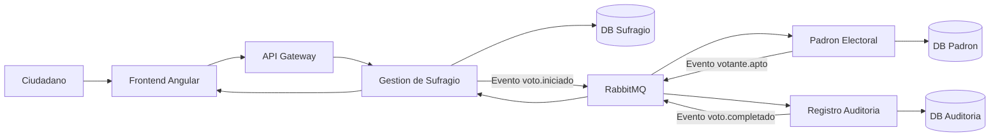

# Proyecto Final - E-Voting

## 1. Descripción del Problema

El sistema E-Voting permite validar de forma segura la participación de ciudadanos en un proceso electoral electrónico.

El proceso inicia cuando un ciudadano ingresa su RUT. Posteriormente se verifica su elegibilidad en el padrón electoral y finalmente se registra la participación de manera anónima, generando un certificado digital de votación.

La solución utiliza una arquitectura basada en microservicios y comunicación asíncrona mediante eventos.

## 2. Arquitectura del Sistema



### 2.1 Componentes

- Frontend Angular: interfaz para el ciudadano.
- API Gateway: punto único de acceso.
- Gestión de Sufragio: recibe solicitudes REST.
- Padrón Electoral: valida elegibilidad.
- Registro de Auditoría: registra participación.
- RabbitMQ: comunicación asíncrona.

### 2.2 Responsabilidades de los Microservicios

#### 2.2.1 Gestión de Sufragio

- Recibe solicitudes REST.
- Valida formato del RUT.
- Registra solicitudes de voto.
- Publica evento voto.iniciado.
- Recibe confirmación final del proceso.

#### 2.2.2 Padrón Electoral

- Escucha evento voto.iniciado.
- Verifica si el ciudadano existe.
- Verifica si está habilitado.
- Verifica si ya votó.
- Publica evento votante.apto.

#### 2.2.3 Registro de Auditoría

- Escucha evento votante.apto.
- Registra participación.
- Genera certificado digital.
- Publica evento voto.completado.


### 2.3 Colas de Mensajería

| Cola | Productor | Consumidor |
|--------|------------|------------|
| voto.iniciado | Gestión de Sufragio | Padrón Electoral |
| votante.apto | Padrón Electoral | Registro de Auditoría |
| voto.completado | Registro de Auditoría | Gestión de Sufragio |

## 3. Flujo de Negocio

1. El ciudadano ingresa su RUT.
2. Gestión de Sufragio registra la solicitud.
3. Se publica el evento voto.iniciado.
4. Padrón Electoral verifica la habilitación.
5. Se publica el evento votante.apto.
6. Registro de Auditoría registra la participación.
7. Se genera un certificado digital.
8. Gestión de Sufragio actualiza el estado final.

## 4. Contratos de Datos

### 4.1 Evento voto.iniciado

```json
{
  "event": "voto.iniciado",
  "votoId": "uuid",
  "rut": "12345678-9",
  "fecha": "2026-06-19T20:00:00Z"
}
```
### 4.2 Evento votante.apto

```json
{
  "event": "votante.apto",
  "votoId": "uuid",
  "rut": "12345678-9",
  "habilitado": true
}
```

### 4.3 Evento voto.completado

```json
{
  "event": "voto.completado",
  "votoId": "uuid",
  "certificado": "CERT-0001"
}
```


## 5. Bases de Datos

### 5.1 Gestión de Sufragio

| Campo | Tipo |
|---------|---------|
| id | NUMBER(100) |
| rut | VARCHAR(12) |
| estado | VARCHAR(20) |
| fecha | DATE |

### 5.2 Padrón Electoral

- rut
- nombre
- habilitado
- ya_voto

### 5.3 Registro de Auditoría

- id
- voto_id
- certificado
- fecha
  

## Estructura del Proyecto

## Configuración Local

## Guía de Acceso

## Manual Operativo


##  X. Organización del Equipo

### X.1 Integrantes

- Ivan Callasaya
- Cristian Huanca
- Fabian Quezada
- Byron Santibañez


### X.2 Distribución de Responsabilidades

| Integrante | Rol Principal | Rol Secundario |
|------------|---------------|----------------|
| Cristian Huanca | Arquitectura y Backend | Kubernetes |
| Integrante 2 | Frontend Angular | Testing |
| Integrante 3 | RabbitMQ y Eventos | Base de Datos |
| Integrante 4 | DevOps y CI/CD | Documentación |

### X.3 Acuerdos de Trabajo

- Todos los integrantes deben comprender la arquitectura completa.
- Cada integrante debe ser capaz de explicar el funcionamiento de cualquier componente.
- Se realizará una revisión interna semanal de avances.
- Toda decisión técnica relevante quedará documentada en el repositorio.
