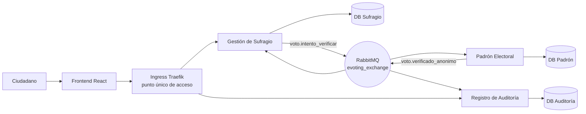

# Proyecto Final - E-Voting (Grupo 6)

## 1. Descripción del Problema

El sistema E-Voting permite validar de forma segura la participación de ciudadanos en un proceso electoral electrónico.

El proceso inicia cuando un ciudadano ingresa su identificador (`ciudadanoId`) y su candidato elegido. Posteriormente se verifica su elegibilidad en el padrón electoral (existe, está habilitado, no ha votado antes) y finalmente se registra la participación de manera **anónima** en un log de auditoría, que permite calcular el resultado real de la elección sin que ninguna fila, en ninguna base de datos, pueda asociar a un ciudadano con el candidato que eligió.

La solución utiliza una arquitectura de microservicios con comunicación asíncrona basada en eventos (RabbitMQ), cada uno con su propia base de datos PostgreSQL aislada.


## 2. Arquitectura del Sistema



### 2.1 Componentes

- **Frontend (React + Vite):** interfaz para el ciudadano, sirve un SPA estático detrás de Nginx.
- **Ingress (Traefik, incluido en K3s):** punto único de acceso por nombre de dominio, enruta por path hacia cada microservicio. No existe un microservicio "API Gateway" separado — ver sección 2.4 para la justificación.
- **Gestión de Sufragio (`servicio-sufragio`):** expone la API REST que usa el frontend, inicia la sesión de voto y publica el evento de verificación.
- **Padrón Electoral (`servicio-padron`):** valida elegibilidad del ciudadano y previene doble voto.
- **Registro de Auditoría (`servicio-auditoria`):** registra la participación de forma anónima y expone el conteo/resultado de la elección.
- **RabbitMQ:** exchange `evoting_exchange` (tipo `topic`), comunicación asíncrona entre los tres microservicios.
- **PostgreSQL x3:** una base aislada por microservicio (`db_sufragio`, `db_padron`, `db_auditoria`).

### 2.2 Responsabilidades de los Microservicios

#### 2.2.1 Gestión de Sufragio (`servicio-sufragio`, puerto 3001)

- Expone `GET /api/sufragio/eleccion-activa`, `POST /api/sufragio/votar`, `GET /api/sufragio/estado/:sesionId`.
- Valida y crea la sesión de voto en estado `INICIADO`.
- Publica el evento `voto.intento_verificar` (incluye `candidatoId` de paso, sin persistirlo).
- Consume `voto.verificado_anonimo` para resolver la sesión a `APROBADO` o `RECHAZADO`.
- **Nunca persiste `candidatoId`** en su propia base — solo lo retransmite en el evento.

#### 2.2.2 Padrón Electoral (`servicio-padron`, puerto 3002)

- Escucha el evento `voto.intento_verificar`.
- Verifica si el ciudadano existe, está habilitado y no ha votado antes en esa elección.
- Publica el evento `voto.verificado_anonimo` con el resultado (`APROBADO`/`RECHAZADO`).
- Reenvía `candidatoId` tal cual lo recibió (pass-through) para que auditoría pueda contarlo — **tampoco lo persiste**, ni incluye `ciudadanoId` en lo que publica.

#### 2.2.3 Registro de Auditoría (`servicio-auditoria`, puerto 3003)

- Escucha el mismo evento `voto.verificado_anonimo`.
- Registra la verificación de forma idempotente (única fila por `sesionId`).
- Expone el conteo agregado y el conteo por candidato para tallar la elección.
- Esta base **nunca contiene `ciudadanoId`**, por lo que ninguna fila permite reconstruir quién votó por quién.


### 2.3 Colas y Bindings de Mensajería

Exchange: `evoting_exchange` (topic, durable). Cada microservicio tiene su propia cola durable con dead-lettering (`evoting_exchange.dlx`) para mensajes no procesables.

| Cola | Binding (routing key) | Productor | Consumidor |
|------|------------------------|-----------|------------|
| `padron.verificar` | `voto.intento_verificar` | Gestión de Sufragio | Padrón Electoral |
| `sufragio.resultado` | `voto.verificado_anonimo` | Padrón Electoral | Gestión de Sufragio |
| `auditoria.registrar` | `voto.verificado_anonimo` | Padrón Electoral | Registro de Auditoría |

### 2.4 Sobre el "API Gateway"

El enunciado pide un punto único de acceso. En este proyecto ese rol lo cumple el **Ingress de Traefik** (incluido por defecto en K3s), que expone un solo dominio por ambiente (`qa.grupo6.uta.cl` / `prod.grupo6.uta.cl`) y enruta por path hacia el frontend y los backends, sin exponer puertos individuales. No se construyó un microservicio "API Gateway" independiente porque el Ingress ya resuelve el requisito de acceso único sin agregar un salto de red adicional que no aporta lógica de negocio. Si se quisiera un Gateway propio (autenticación centralizada, rate limiting, agregación de respuestas), el Ingress simplemente apuntaría a ese nuevo servicio en vez de a los backends directamente.

## 3. Flujo de Negocio (estado actual)

1. El ciudadano abre el frontend, que consulta la elección activa y sus candidatos.
2. El ciudadano envía `ciudadanoId` y `candidatoId` a `POST /api/sufragio/votar`.
3. Gestión de Sufragio crea la sesión en estado `INICIADO` y responde `202 Accepted`.
4. Se publica el evento `voto.intento_verificar`.
5. Padrón Electoral verifica elegibilidad (existe / habilitado / no ha votado) y registra la participación en `votos_efectuados`.
6. Se publica el evento `voto.verificado_anonimo` con el resultado.
7. **En paralelo:** Gestión de Sufragio resuelve la sesión (`APROBADO`/`RECHAZADO`) y Registro de Auditoría guarda el registro anónimo.
8. El frontend hace polling de `GET /api/sufragio/estado/:sesionId` hasta obtener el resultado final.


## 4. Contratos de Datos

### 4.1 Evento `voto.intento_verificar`

Publicado por Gestión de Sufragio, consumido por Padrón Electoral.

```json
{
  "eventId": "evt-1752345600000",
  "tipo": "voto.intento_verificar",
  "timestamp": "2026-07-13T20:00:00.000Z",
  "origen": "servicio-sufragio",
  "payload": {
    "sesionId": "uuid",
    "ciudadanoId": "12345678-9",
    "eleccionId": "eleccion-2026-presidencial",
    "candidatoId": "cand-001"
  }
}
```

### 4.2 Evento `voto.verificado_anonimo`

Publicado por Padrón Electoral, consumido en paralelo por Gestión de Sufragio y Registro de Auditoría. **Nunca incluye `ciudadanoId`.**

```json
{
  "eventId": "evt-1752345601000",
  "tipo": "voto.verificado_anonimo",
  "timestamp": "2026-07-13T20:00:01.000Z",
  "origen": "servicio-padron",
  "payload": {
    "sesionId": "uuid",
    "eleccionId": "eleccion-2026-presidencial",
    "candidatoId": "cand-001",
    "resultado": "APROBADO",
    "motivo": null,
    "eventoEntradaId": "evt-1752345600000"
  }
}
```


## 5. Bases de Datos

Cada microservicio tiene su propia base PostgreSQL aislada, inicializada vía scripts SQL versionados (`db-init/`) y montados también como `ConfigMap` en Kubernetes (`k8s/base/db-init/`).

### 5.1 `db_sufragio` (servicio-sufragio)

**`sesiones_sufragio`**

| Campo | Tipo |
|---|---|
| id | UUID (PK) |
| ciudadano_id | VARCHAR(20) |
| eleccion_id | VARCHAR(50) |
| estado | ENUM `INICIADO` / `APROBADO` / `RECHAZADO` |
| motivo_resultado | VARCHAR(255) |
| fecha_resolucion | TIMESTAMPTZ |

**`elecciones`** — `id`, `nombre`, `activa` (único índice parcial para que solo haya una elección activa), `fecha_inicio`, `fecha_fin`.

**`candidatos`** — `id`, `candidato_id`, `eleccion_id` (FK a `elecciones`), `nombre`, `partido`.


### 5.2 `db_padron` (servicio-padron)

**`ciudadanos`** — `id`, `ciudadano_id` (único), `nombre`, `apellido`, `habilitado`, `motivo_inhabilitacion`, `elecciones_habilitadas` (array, vacío = habilitado para todas).

**`historial_habilitacion`** — `id`, `ciudadano_id`, `accion` (ENUM `HABILITADO`/`INHABILITADO`), `motivo`, `operador`.

**`votos_efectuados`** — `id`, `ciudadano_id`, `eleccion_id`, `sesion_id`, `fecha_participacion`, con `UNIQUE(ciudadano_id, eleccion_id)` para impedir doble voto. No guarda `candidatoId`.

### 5.3 `db_auditoria` (servicio-auditoria)

**`registros_auditoria`** — `id`, `sesion_id` (único), `eleccion_id`, `candidato_id` (solo si `resultado = APROBADO`), `resultado` (ENUM `APROBADO`/`RECHAZADO`), `motivo`, `evento_origen_id`, `fecha_registro`.


## 6. Estructura del Proyecto

```
proyecto-aplicaciones-distribuidas/
├── backend/
│   ├── servicio-sufragio/       # S1 — API REST + productor voto.intento_verificar
│   │   └── src/
│   │       ├── config/          # database.js, rabbitmq.js
│   │       ├── consumers/       # resultadoConsumer.js
│   │       ├── controllers/     # sufragioController.js
│   │       ├── models/          # SesionSufragio, Eleccion, Candidato
│   │       ├── producers/       # votoProducer.js
│   │       ├── repositories/
│   │       ├── routes/
│   │       └── services/
│   ├── servicio-padron/         # S2 — valida elegibilidad
│   │   └── src/ (misma estructura: consumers/, producers/, models/ Ciudadano, HistorialHabilitacion, VotoEfectuado ...)
│   └── servicio-auditoria/      # S3 — registro anónimo + resultados
│       └── src/ (consumers/, controllers/, models/ RegistroAuditoria ...)
├── frontend/                    # React + Vite, servido por Nginx en producción
│   └── src/
│       ├── api.js               # cliente REST hacia /api/sufragio
│       └── App.jsx
├── db-init/                     # Scripts SQL fuente (init-sufragio.sql, init-padron.sql, init-auditoria.sql)
├── k8s/
│   ├── base/                    # Recursos comunes (Deployments, Services, PVCs, Secrets, ConfigMaps de init.sql)
│   └── environments/
│       ├── local/                # Overlay para Docker Desktop / K3d local (sin Ingress, vía port-forward)
│       ├── qa/                    # Overlay QA — namespace grupo6-qa, 1 réplica, host qa.grupo6.uta.cl
│       └── prod/                  # Overlay PROD — namespace grupo6-prod, 2 réplicas, host prod.grupo6.uta.cl
├── docker-compose.yml           # Levantamiento local sin Kubernetes
└── README.md
```


## 7. Guía de Acceso (QA / PROD en el clúster K3s)

Para cumplir con la política de aislamiento y seguridad, este ecosistema no expone puertos aleatorios, sino que enruta el tráfico a través del Ingress Controller utilizando nombres de dominio virtuales.

Para acceder a las interfaces desde un equipo local, debe simular la resolución DNS modificando su archivo `hosts` local para apuntar a la dirección IP de nuestro Nodo Maestro (146.83.102.25).

**Para Windows:**
1. Abra el Bloc de notas como Administrador.
2. Abra el archivo `C:\Windows\System32\drivers\etc\hosts`.
3. Agregue las siguientes líneas al final:
   146.83.102.25   qa.grupo6.uta.cl
   146.83.102.25   prod.grupo6.uta.cl

**Para macOS / Linux:**
1. Ejecute en terminal: `sudo nano /etc/hosts`
2. Agregue las siguientes líneas al final:
   146.83.102.25   qa.grupo6.uta.cl
   146.83.102.25   prod.grupo6.uta.cl

Una vez guardado, puede acceder en su navegador a `http://qa.grupo6.uta.cl` o `http://prod.grupo6.uta.cl`.


## 8. Manual Operativo

Comandos útiles para verificar el estado del sistema una vez desplegado (reemplazar `<ns>` por `grupo6-qa` o `grupo6-prod` según el ambiente):

### 8.1 Estado general

```bash
kubectl -n <ns> get pods -o wide
kubectl -n <ns> get deployments
kubectl -n <ns> get pvc
kubectl -n <ns> get ingress
```

### 8.2 Logs de un servicio

```bash
kubectl -n <ns> logs -l app=servicio-sufragio --tail=100 -f
kubectl -n <ns> logs -l app=servicio-padron --tail=100 -f
kubectl -n <ns> logs -l app=servicio-auditoria --tail=100 -f
```

### 8.3 Verificar RabbitMQ y sus colas

```bash
# Ver colas y cantidad de mensajes
kubectl -n <ns> exec deploy/rabbitmq -- rabbitmqctl list_queues name messages messages_ready

# Ver bindings del exchange
kubectl -n <ns> exec deploy/rabbitmq -- rabbitmqctl list_bindings
```

### 8.4 Verificar una base de datos

```bash
kubectl -n <ns> exec -it deploy/postgres-sufragio -- psql -U user_sufragio -d db_sufragio -c "SELECT estado, count(*) FROM sesiones_sufragio GROUP BY estado;"
kubectl -n <ns> exec -it deploy/postgres-auditoria -- psql -U user_auditoria -d db_auditoria -c "SELECT resultado, count(*) FROM registros_auditoria GROUP BY resultado;"
```

### 8.5 Probar el flujo end-to-end vía API

```bash
curl http://qa.grupo6.uta.cl/api/sufragio/eleccion-activa
curl -X POST http://qa.grupo6.uta.cl/api/sufragio/votar \
  -H "Content-Type: application/json" \
  -d '{"ciudadanoId":"11111111-1","candidatoId":"cand-001"}'
# guardar el sesionId de la respuesta y hacer polling:
curl http://qa.grupo6.uta.cl/api/sufragio/estado/<sesionId>
```

### 8.6 Auditoría de Persistencia y Copias de Seguridad (CronJobs)
El sistema ejecuta respaldos automáticos intra-clúster de las 3 bases de datos cada 10 minutos, conservando solo las últimas 6 copias. Para auditar esto en vivo:

1. **Verificar la programación de los CronJobs:**
   `kubectl get cronjobs -n grupo6-prod`

2. **Certificar el almacenamiento físico (Ejemplo DB Sufragio):**
   ```bash
   kubectl exec deploy/postgres-sufragio -n grupo6-prod -- ls -lh /backups
   ```

### 8.7 Trazas Unificadas (Logging Centralizado)
Para observar el flujo asíncrono de los JSON viajando por RabbitMQ sin tener que saltar de contenedor en contenedor, ejecute este comando para seguir todos los logs del backend productivo en tiempo real:

`kubectl logs -f -l tier=backend --all-containers=true -n grupo6-prod`
*(Requiere que los deployments tengan la etiqueta tier: backend)*.

## 9. Organización del Equipo

### 9.1 Integrantes

- Ivan Callasaya
- Cristian Huanca
- Fabian Quezada
- Byron Santibañez

### 9.2 Distribución de Responsabilidades

| Integrante | Rol Principal | Rol Secundario |
|------------|---------------|----------------|
| Cristian Huanca | Arquitectura y Backend | Kubernetes |
| Ivan Callasaya | Frontend React | Testing |
| Byron Santibañez | RabbitMQ y Eventos | Base de Datos |
| Fabian Quezada | DevOps y CI/CD | Documentación |

### 9.3 Acuerdos de Trabajo

- Todos los integrantes deben comprender la arquitectura completa.
- Cada integrante debe ser capaz de explicar el funcionamiento de cualquier componente.
- Se realizará una revisión interna semanal de avances.
- Toda decisión técnica relevante quedará documentada en el repositorio.
